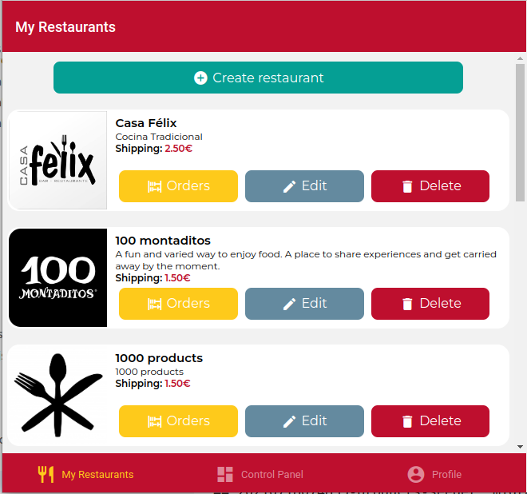
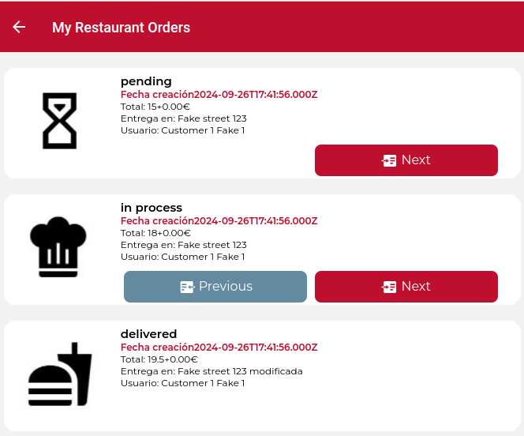

# IISSI-2 IS: Examen Tercera Convocatoria

## Proyecto base suministrado

Este repositorio incluye el backend completo (carpeta `DeliverUS-Backend`) y el frontend de `owner` (carpeta `DeliverUS-Frontend-Owner`). Servirá como base para realizar el examen de laboratorio de la asignatura.

## Enunciado

Se requiere completar la funcionalidad para el usuario 'owner'. Para ello, vamos a permitir la visualización de las órdenes mediante un botón asociado a cada restaurante que el 'owner' posea. Implemente las modificaciones que se requieran de acuerdo a las siguientes imágenes:



En lo que se refiere al contenido de las vistas específicas para cada restaurante, debe aparecer un listado con un icono informativo del estado de la orden (incluidos en los assets del frontend como 'timer-sand.jpg', 'chef-hat.jpg', 'truck-delivery.jpg' y 'food.jpg'), acompañado de información básica de dicha orden: fecha de creación, total, dirección del envío e información del usuario (nombre y apellidos). El orden del listado será por status: primero 'pending', después 'in process', posteriormente 'sent' y finalmente, 'delivered'. A igualdad, se tomará la hora de creación como elemento de desempate. En la siguiente imagen se puede ver el diseño propuesto:



Nótese que queremos añadir la posibilidad de cambiar el status de la orden por parte del 'owner'. Para ello, se habilitará un botón que realizará el cambio entre estados consecutivos temporalmente. De la misma forma, se podrá deshacer la acción en los siguientes 5 minutos desde que se realizó el cambio para deshacer posibles errores del usuario owner (pasado los 5 minutos, las órdenes ya no podrán ser devueltas a su estado anterior). En cualquier caso, tras pulsar los botones, se debe cambiar la vista para actualizar la lista de órdenes y en el caso de que el status sea 'pending' o 'delivered', los botones que pasan al anterior o al posterior estado, respectivamente, no deben aparecer.

Tenga en cuenta que:

1. No se deben permitir de ninguna manera dos cambios de estados concurrentes.

2. El cambio de estado viene definido por los valores de las fechas que se registran en las órdenes como se describe en el modelo:

```javascript
...
getStatus () {
      if (this.deliveredAt) { return 'delivered' }
      if (this.sentAt) { return 'sent' }
      if (this.startedAt) { return 'in process' }
      return 'pending'
    }
...
```

3. Una orden sigue la siguiente secuencia: 'pending' -> 'in process' -> 'sent' -> 'delivered'

4. Para simplificar el código, no tenga en cuenta las variaciones en las estadísticas extraídas en las operaciones analíticas referentes al cálculo del tiempo medio de servicio.

5. Para obtener la diferencia entre fechas en minutos puede consultar el siguiente [enlace](https://www.geeksforgeeks.org/how-to-calculate-minutes-between-two-dates-in-javascript/).

6. Tenga en cuenta que los botones de la vista asociados a cada orden, sólo deben aparecer si la operación forward o backward correspondiente es válida porque exista un estado válido al que volver o avanzar y en el caso de la operación backward, esté dentro del límite de tiempo de los 5 minutos.

## Preparación del entorno

### a) Windows

* Abra un terminal y ejecute el comando `npm run install:all:win`.

### b) Linux/MacOS

* Abra un terminal y ejecute el comando `npm run install:all:bash`.

## Ejecución

### Backend

* Para **rehacer las migraciones y seeders**, abra un terminal y ejecute el comando

    ```Bash
    npm run migrate:backend
    ```

* Para **ejecutarlo**, abra un terminal y ejecute el comando

    ```Bash
    npm run start:backend
    ```

### Frontend

* Para **ejecutar la aplicación frontend de `owner`**, abra un nuevo terminal y ejecute el comando

    ```Bash
    npm run start:frontend:owner
    ```

## Depuración

* Para **depurar el backend**, asegúrese de que **NO** existe una instancia en ejecución, pulse en el botón `Run and Debug` de la barra lateral, seleccione `Debug Backend` en la lista desplegable, y pulse el botón de *Play*.

* Para **depurar el frontend**, asegúrese de que **EXISTE** una instancia en ejecución del frontend que desee depurar, pulse en el botón `Run and Debug` de la barra lateral, seleccione `Debug Frontend` en la lista desplegable, y pulse el botón de *Play*.

## Test

* Para comprobar el correcto funcionamiento de backend puede ejecutar el conjunto de tests incluido a tal efecto. Para ello ejecute el siguiente comando:

    ```Bash
    npm run test:backend
    ```

**Advertencia: Los tests no pueden ser modificados.**

## Problemas con los puertos

En ocasiones, los procesos de backend o frontend, con o sin depuración, pueden quedarse bloqueados sin liberar los puertos utilizados, impidiendo que puedan ejecutarse otros procesos. Se recomienda cerrar y volver a iniciar VSC para cerrar dichos procesos.

## Procedimiento de entrega

1. Borrar las carpetas **node_modules** de backend y frontend y **.expo** del frontend.
1. Crear un ZIP que incluya todo el proyecto. **Importante: Comprueba que el ZIP no es el mismo que te has descargado e incluye tu solución**
1. Avisa al profesor antes de entregar.
1. Cuando el profesor te dé el visto bueno, puedes subir el ZIP a la plataforma de Enseñanza Virtual. **Es muy importante esperar a que la plataforma te muestre un enlace al ZIP antes de pulsar el botón de enviar**. Se recomienda descargar ese ZIP para comprobar lo que se ha subido. Un vez realizada la comprobación, puedes enviar el examen.
  
Si no se siguen estos pasos de manera escrupulosa, cabe la posibilidad de que no se entregue nada o que el ZIP contenga cualquier cosa.
