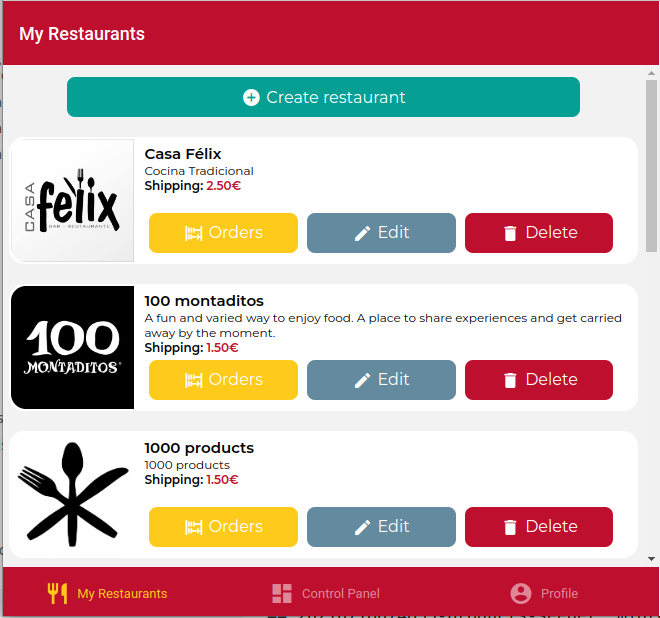

# IISSI-2 IS: Lab Exam October 2024

## About supplied base project

This repository includes the complete backend (folder `DeliverUS-Backend`) and the `owner` frontend (folder `DeliverUS-Frontend-Owner`). It will serve as the basis for the lab exam of the course.

## Statement

It is required to complete features to allow the 'owners' to work with the orders which have been registered in their restaurants. To do so, there will be a new screen to show the orders for a restaurant. Implement the needed code, according to the following screenshots:



Referring to the specific view for each restaurant, in the screen there will be a list where each line includes a icon according to the order state (such icons are included in the assets folder in the frontend, as 'timer-sand.jpg', 'chef-hat.jpg', 'truck-delivery.jpg', and 'food.jpg'), together with basic information of the order: creation datetime, total, shipping address, and customer name and surname. Orders must be shown ordered by status: first 'pending', then 'in process', then'sent', and finally, 'delivered'. On equal conditions, the creation datetime will be taken. The design for these screen is shown in the next image:


Note the functionality for owners to change the order status. To do so, a button will be enabled to change the order to the next status. This change can be undone in the following 5 minutes by means of another button, so that the owner can correct possible errors while preparing their orders. Once 5 minutes are passed, the changes can not be undone, and the undo button will be disabled. In any case, once the button is clicked, the screen must show the updated list of orders. If the status of an order is either 'pending' or 'delivered', the corresponding buttons to undo or change the state must not be shown.

It should be taken into account:

1. Concurrent changes for the same order status are not allowed.

2. The status is defined by the values of the operation datetimes, as described in the 'Orders' model:

```javascript
...
getStatus () {
      if (this.deliveredAt) { return 'delivered' }
      if (this.sentAt) { return 'sent' }
      if (this.startedAt) { return 'in process' }
      return 'pending'
    }
...
```

3. The sequence of status for each order is: 'pending' -> 'in process' -> 'sent' -> 'delivered'

4. To simplify the code, you can omit the code for updating the restaurant statistics.

5. To get the difference between two datetimes in minutes, you can see [enlace](https://www.geeksforgeeks.org/how-to-calculate-minutes-between-two-dates-in-javascript/).

6. Note that both change buttons for each order must be shown only if the corresponding forward or backward operation is valid, because there exists a valid state to forward, or the 5-minute deadline is right to backward.

## Environment Setup

### a) Windows

* Open a terminal and run the command `npm run install:all:win`.

### b) Linux/MacOS

* Open a terminal and run the command `npm run install:all:bash`.

## Execution

### Backend

* To **rebuild migrations and seeders**, open a terminal and run the command

    ```Bash
    npm run migrate:backend
    ```

* To **run it**, open a terminal and run the command

    ```Bash
    npm run start:backend
    ```

### Frontend

* To **run the `owner` frontend application**, open a new terminal and run the command

    ```Bash
    npm run start:frontend:owner
    ```

## Debugging

* To **debug the backend**, ensure that there is **NO** running instance, click the `Run and Debug` button on the sidebar, select `Debug Backend` from the dropdown list, and press the *Play* button.

* To **debug the frontend**, ensure that there **IS** a running instance of the frontend you want to debug, click the `Run and Debug` button on the sidebar, select `Debug Frontend` from the dropdown list, and press the *Play* button.

## Testing

* To verify the correct functioning of the backend, you can run the included set of tests. To do this, run the following command:

    ```Bash
    npm run test:backend
    ```
**Warning: Tests cannot be modified.**

## Port Issues

Sometimes, backend or frontend processes, with or without debugging, may get stuck without releasing the used ports, preventing other processes from running. It is recommended to close and restart VSC to close such processes.

## Submission Procedure

1. Delete the **node_modules** folders from backend and frontend and the **.expo** folder from the frontend.
2. Create a ZIP that includes the entire project. **Important: Ensure that the ZIP is not the same as the one you downloaded and includes your solution**
3. Notify the instructor before submitting.
4. When the instructor gives the green light, you can upload the ZIP to the Virtual Teaching platform. Wait for the platform to show a link to the ZIP before clicking the accept button.

If you do not follow carefully these steps, it is possible either your ZIP is not submitted or it contains something but your solution. 

